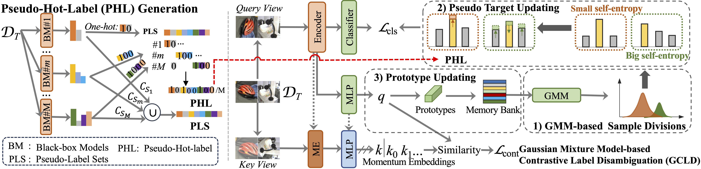

# UFDA-Universal-Federated-Domain-Adaptation-with-Practical-Assumptions--accepted by AAAI 2024

This repository provides the implementation for our paper: [UFDA: Universal Federated Domain Adaptation with Practical Assumptions](https://ojs.aaai.org/index.php/AAAI/article/view/29311)

## Model Review:


## Setup

**Install Package Dependencies**

We need users to declare a base path to store the dataset as well as the log of the training procedure. The directory structure should be
```
base_path
│       
└───data
│   │   Office-31
│       │   amazon
│       │   dslr
|       |   webcam
│   │   OfficeHome
│       │   ...
│   │   VisDA2017+ImageCLEF-DA
```
Our framework now supports four multi-source domain adaptation datasets: ```Office-Home, Office-31, and VisDA2017+ImageCLEF-DA```.
**Dataset Preparation**
*OfficeHome:*
The OfficeCaltech10 dataset can be accessed in [OfficeHome](https://www.hemanthdv.org/officeHomeDataset.html).


